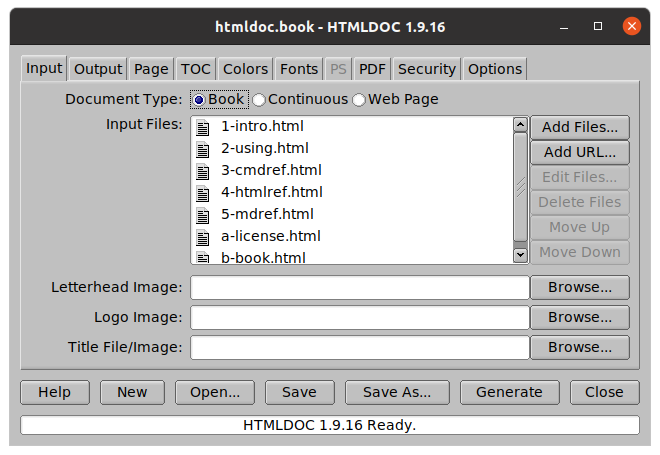

HTMLDOC converts HTML and Markdown source files or web pages to EPUB, PostScript, or PDF files with an optional table of contents. While it currently does not support many things in "the modern web" such as Cascading Style Sheets (CSS), forms, full Unicode, and Emoji characters, it is still useful for converting HTML documentation, invoices, and reports. It provides a convenient GUI and can be integrated with many continuous integration and web server solutions.

Binaries are provided by me for Linux® on the snapcraft store, macOS® (10.14 and higher) on the Github download page, and Microsoft Windows® (10 and higher) on the Github download page. Most Linux distributions also provide native packages.

  <h2>System Requirements</h2>
  

    
Tools:

    <ul>
      <li>C99 compiler (Clang, GCC, MSVC)</li>
      <li>POSIX-compliant `make` (all but Windows)</li>
      <li>Xcode (optional for macOS)</li>
      <li>Visual Studio 2019 or later (Windows)</li>
    </ul>
  

    
Required Libraries:

    <ul>
      <li>GNU TLS (3.0+), LibreSSL (3.0+), or OpenSSL (1.1+)</li>
      <li>ZLIB (1.1+)</li>
    </ul>
  

    
Optional Libraries:

    <ul>
      <li>JPEGLIB (8+) or libjpeg-turbo (2.0+)</li>
      <li>LIBPNG (1.6+)</li>
    </ul>
  

